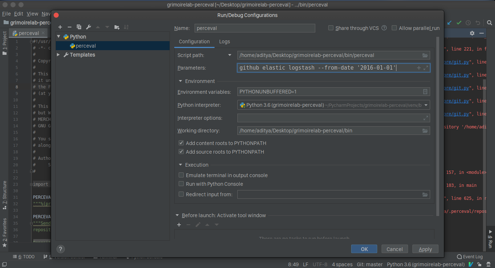
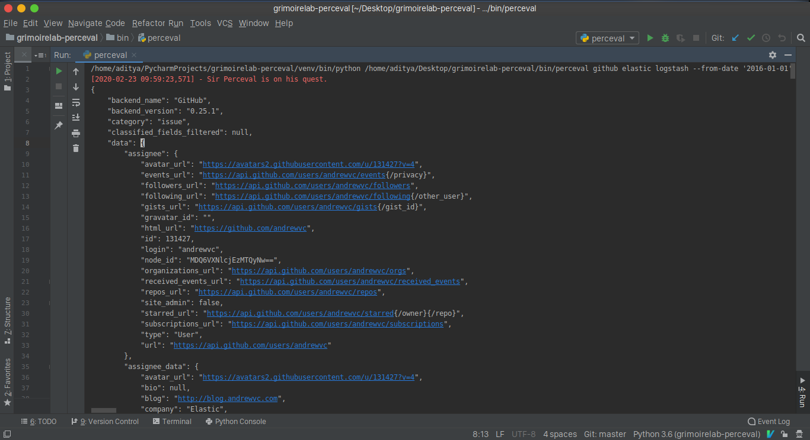

## Set up Perceval to be executed from PyCharm.
------------------------------------------------

After setting up the repo either by cloning it to your machine or by using the import from git option in pycharm, you can install the requirements and run the parceval script by setting the run configurations to:

by setting the `script path` to `bin/parceval`, and passing the parameters in the `parameters` field. Now, run the script.

The output generated on running parceval now gives us:

