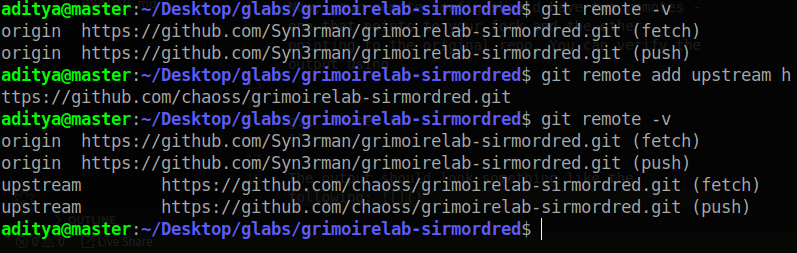

## Set up a dev environment to work on GrimoireLab.
-------------------------------------------

Using the [provided link](https://github.com/chaoss/grimoirelab-sirmordred#setting-up-a-pycharm-dev-environment) as reference, you can fork and cloned the repo for [SirModred](https://github.com/chaoss/grimoirelab-sirmordred) into a local folder(called glabs in my case). 

Then add an `upstream` remote to that repo that points to the original repo using the command

```
git remote add upstream https://github.com/chaoss/grimoirelab-sirmordred.git
```

Now, your remote config should have two remotes - one that points to your fork and the other pointing to the original repo. You can verify the output using 

```
git remote -v
```

The output should look something like the following: 

Now, opening the glabs directory in pycharm, 