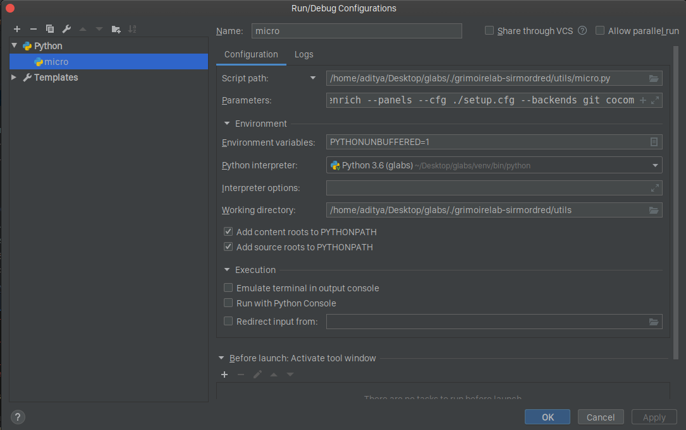
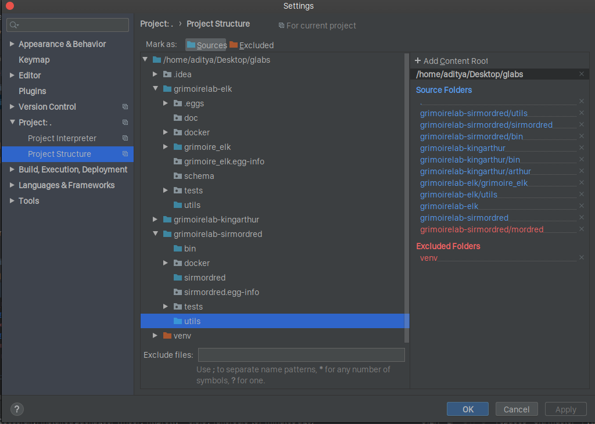

## Set up a dev environment to work on GrimoireLab.

Using the [provided link](https://github.com/chaoss/grimoirelab-sirmordred#setting-up-a-pycharm-dev-environment) as reference, you can fork and cloned the repo for [SirModred](https://github.com/chaoss/grimoirelab-sirmordred) into a local folder(called glabs in my case). 

Then add an `upstream` remote to that repo that points to the original repo using the command

```
git remote add upstream https://github.com/chaoss/grimoirelab-sirmordred.git
```

Now, your remote config should have two remotes - one that points to your fork and the other pointing to the original repo. You can verify the output using 

```
git remote -v
```

The output should look something like the following: 

Now, opening the glabs directory in pycharm, you can set the run/debug configurations. We set the `script path` to `micro.py` and pass arguments as shown in the example [here](https://github.com/chaoss/grimoirelab-sirmordred#setting-up-a-pycharm-dev-environment).

Run/debug config:



You need to install the requirements in a virtual env that pycharm creates by default, but gives you the option to configure it if it hasn't done it.

The project stucture looks like:


Once this is done, you can install the docker-compose given below to install the 3 components required - ElasticSearch, Kibiter and MySQL/MariaDB. 

```
elasticsearch:
  restart: on-failure:5
  image: bitergia/elasticsearch:6.1.0-secured
  command: elasticsearch -Enetwork.bind_host=0.0.0.0 -Ehttp.max_content_length=2000mb
  environment:
    - ES_JAVA_OPTS=-Xms2g -Xmx2g
  ports:
    - 9200:9200

kibiter:
  restart: on-failure:5
  image: bitergia/kibiter:secured-v6.1.4-5
  environment:
    - PROJECT_NAME=Development
    - NODE_OPTIONS=--max-old-space-size=1000
    - ELASTICSEARCH_URL=https://elasticsearch:9200
    - ELASTICSEARCH_USER=kibanaserver
    - ELASTICSEARCH_PASSWORD=kibanaserver
  links:
    - elasticsearch
  ports:
    - 5601:5601
    
mariadb:
  restart: on-failure:5
  image: mariadb:10.0
  expose:
    - "3306"
  ports:
    - "3306:3306"
  environment:
    - MYSQL_ROOT_PASSWORD=
    - MYSQL_ALLOW_EMPTY_PASSWORD=yes
    - MYSQL_DATABASE=test_sh
  command: --wait_timeout=2592000 --interactive_timeout=2592000 --max_connections=300
  log_driver: "json-file"
  log_opt:
      max-size: "100m"
      max-file: "3"
```

Run the command `docker-compose up -d` on your machine. If you already have MySQL installed, you can use the command `sudo service mysql stop` to stop it before running the command.4

Thus, we have set up a dev environment to work on GrimoireLab.