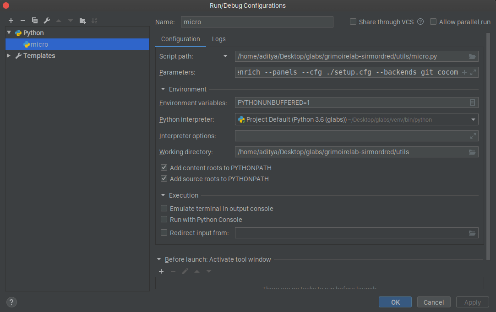
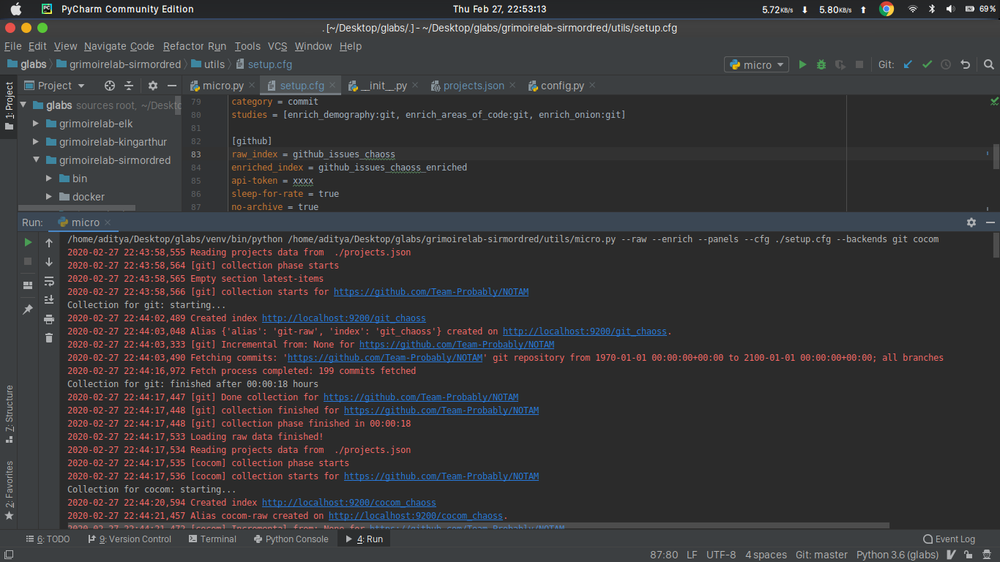
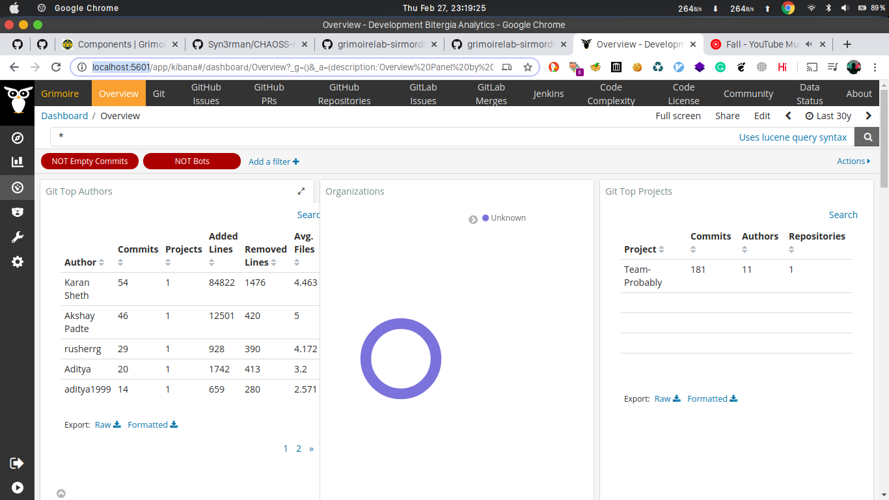

## Execute micro-mordred to collect, enrich and visualize data from any GitHub repository.

Once you have set up the dev environment for grimoire lab, you can edit the run/debug configuration to set the script path to run micro mordred. The configuration looks like:



We can change the `projects.json` file to collect data from your own GitHub repo, in this case a hackathon project made by me and my friends.

```
{
    "Team-Probably": {
        "git": [
            "https://github.com/Team-Probably/NOTAM"
        ],
        "cocom": [
                "https://github.com/Team-Probably/NOTAM"
        ],
        "colic": [
            "https://github.com/Team-Probably/NOTAM"
        ],
        "*github": [
            "https://github.com/Team-Probably/NOTAM"
        ],
        "*github:pull": [
            "https://github.com/Team-Probably/NOTAM"
        ],
        "github:repo": [
            "https://github.com/Team-Probably/NOTAM"
        ]
    }
}
```

You can now run the script by passing arguments to the script and expect the following output (provided you have the containers for ElasticSearch, Kibiter and MySQL/MariaDB running).



Now, you can go to `http://localhost:5601/` to visualize the data. The output should look like:



Thus, we have used micro-mordred to collect, enrich and visualize data.