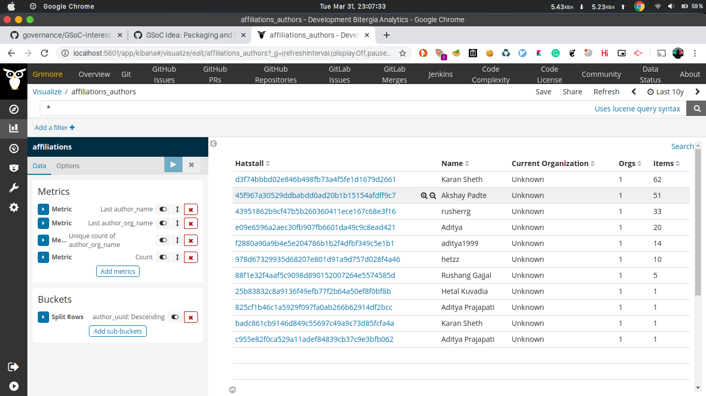

## Execute micro-mordred to obtain data from the study enrich_geolocation for any GitHub repository.

To complete this task, we edit the Mordred config file and add the following lines into it:

```
[git]
raw_index = git_chaoss
enriched_index = git_chaoss_enriched
latest-items = false
category = commit
studies = [enrich_demography:git,enrich_geolocation:user, enrich_areas_of_code:git, enrich_onion:git]

[github:pull]
raw_index = github_pulls_chaoss
enriched_index = github_pulls_chaoss_enriched
api-token = xxxx
sleep-for-rate = true
no-archive = true
category = pull_request
sleep-time = 300
studies = [enrich_onion:github, enrich_geolocation:user, enrich_geolocation:assignee]

[enrich_geolocation:user]
location_field = user_location
geolocation_field = user_geolocation

[enrich_geolocation:assignee] 
location_field = assignee_location
geolocation_field = assignee_geolocation
```

We can see the ouput in our local Kibiter instance: 
