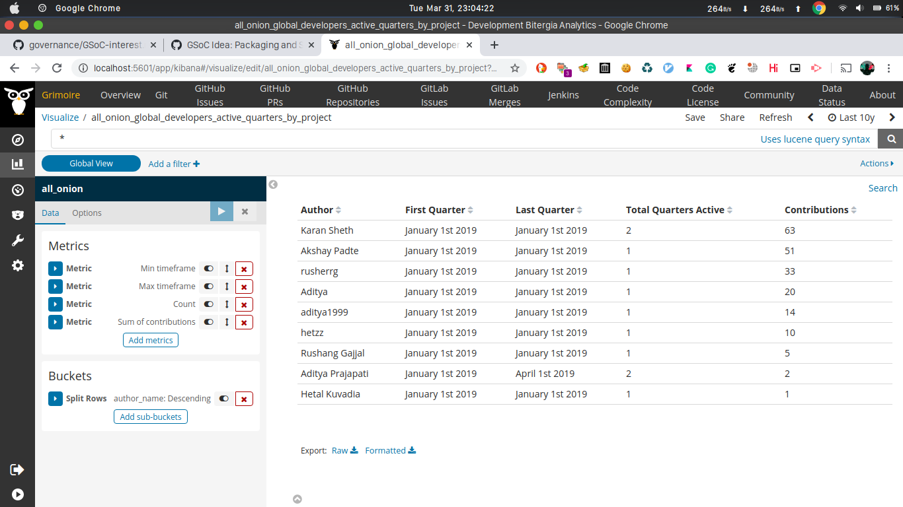

## Create a visualization in Kibiter that shows the top 10 contributors in any GitHub repository and. If you complete Microtask 6, you can create a visualization that shows where the contributors are located.

Run micromordred and open Kibiter to get the following output:

