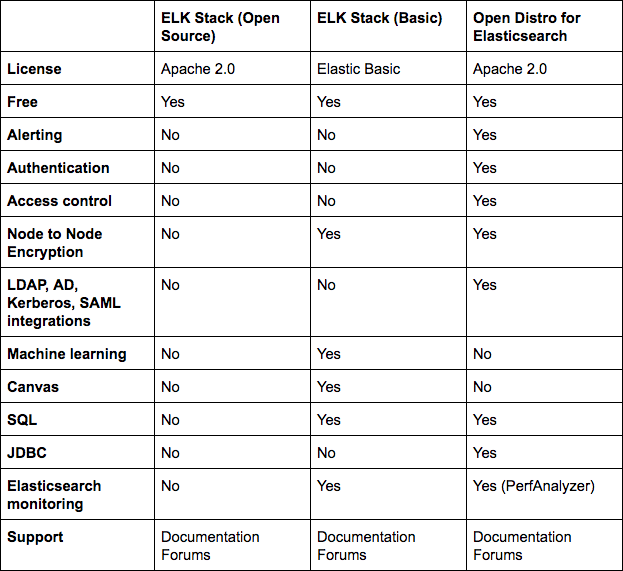

## After reading the documentation at https://www.elastic.co/elastic-stack and https://opendistro.github.io/for-elasticsearch/ try to answer the following questions:

> What's an index?
 
Elasticsearch is a document oriented NoSQL database that stores information as documents, using JSON to serialize data. In elasticsearch, a document belongs to a type, and the types live inside an index. Thus, an index can be thought of as a collection of similar types of documents. 

Elasticsearch by default indexes the document by creating an inverted index that allows for efficient and fast full-text searches. More about indexing can be read in [this awesome article](https://codingexplained.com/coding/elasticsearch/understanding-the-inverted-index-in-elasticsearch).

> Okay, but how does elasticsearch store data?

At a high level, data is stored on nodes, which are servers that are part of a cluster. Each node participates in the indexing and searching capabilities of the cluster. There is usally a master node that is responsible for coordinating changes to the cluster, such as adding or removing nodes, creating or removing indices, etc.. 

It is possible that an index is too big to be stored on a single node, and thus indexes are divided into shards and distributed across the nodes in a cluster. [This link](https://lucene.apache.org/core/8_4_1/core/org/apache/lucene/codecs/lucene84/package-summary.html#package.description) provides a detailed explanation about how the data is stored. 
(Courtesy of [whatgeorgemade](https://www.reddit.com/user/whatgeorgemade) for helping me out [here](https://www.reddit.com/r/elasticsearch/comments/fav9nx/how_does_elasticsearch_store_data/))

> What's an index pattern?

An index pattern tells kibana which indexes contain data that you want to work with.

> What is stored in the index .kibana?

Kibana has to persist the saved searches, visualisations etc.. of the user so that they can be loaded the next time it is started. It uses elasticsearch to store these objects as documents in the `.kibana` index, which can be changed in the `kibana.index` config setting. 

This index file is created when you create the kibana server for the first time, and for each new index pattern that is created, a corresponding document is added to the `.kibana` index. 

More details [here](https://www.elastic.co/blog/kibana-under-the-hood-object-persistence)

> What is a tenant?

A tenant can be a user, an organisation, a project, an application, a client or something different. 

> What the difference between ElasticSearch and ODFE?

The image below makes a good enough comparision between ODFE and elasticsearch: 

